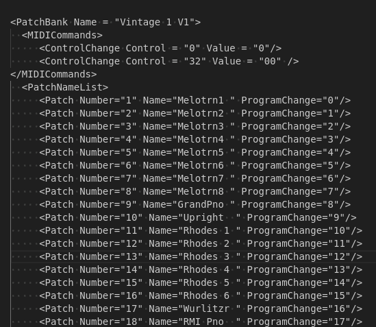

# SY85-Sysex-to-Midnam
A python 3 script to convert Yamaha SY85 synth  bulk dump to midnam patch files.  Outputs list of patches only.  No midnam header.  Make sure to change any '&' characters in patch names to something else like 'and' or 'N' instead of '&'.  '&' Characters will not xlint properly.

## To Use
Edit commeneted variables in .py file to add sysex filename, bank prefix (name of disk / patch set), and output filename.

Paste output after :

\</AvailableForChannels\\>   
   but between 
   ...
   ...
    \</ChannelNameSet\>
  \</MasterDeviceNames\>
\</MIDINameDocument\>

in midnam file.

Example Output : 

